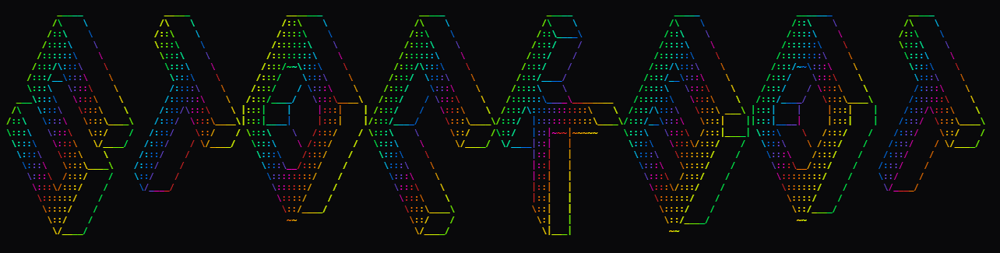

# <p align="center">
   
</p>

# stockbot — technical README

> Research-grade LSTM experiment runner for short-term market signals — built for reproducibility, customization, and exploratory production demos.

Badges:   

This repository contains a Python-based experimental trading / research toolkit focused on LSTM predictive models for tick/market data plus an opinionated live/demo runner. This README is written for technical users who want to understand internals, reproduce results, and safely customize the project.

## Table of contents

- 📌 Project overview
- 📐 Design contract (inputs, outputs, error modes)
- 🗂 Repository layout (file-by-file technical summary)
- 🔁 Data pipeline (raw → features → model-ready)
- 🧠 Model architecture & training (what to expect + how to customize)
- ▶️ Running the project (env, commands, PowerShell tips)
- 🔧 Customization checklist (hyperparameters, data, model, storage)
- ✅ Quality gates & testing recommendations
- 🚀 Deployment, performance & GPU tips
- 🐞 Troubleshooting
- 🛡 Security & safe practices
- 🧭 Next steps and suggested improvements
- ✨ Credits & authors

---

## Project overview

This project is an experimental research toolkit for time-series forecasting using LSTM models targeting short-horizon market signals. It blends data preprocessing, model training, artifact management, and lightweight visualization into an easily forkable research repo.

Core capabilities:

- High-level ingestion from CSV / SQLite (`tick_data.csv`, `market_data.db`).
- End-to-end preprocessing → sequence creation → LSTM training (`train_lstm_model.py`).
- Model artifact management (Keras `.h5` / `.keras`) and scaler persistence (`scaler.pkl`).
- Small orchestration for automated retrain/promote flows (`auto_trainer.py`) and CSV export (`export_to_csv.py`).
- Demo & visualization runners (`MainDemo.py`, `Main.py`, `live_chart.py`) for interactive checks and plot-driven debugging.

Note: existing model artifacts (`best_model.h5`, `final_model.h5`, etc.) are outputs. Reproduce them by running the training pipeline with the same preprocessing and random seeds.

## Contract (short)

- Inputs: tabular tick/candle CSV (`tick_data.csv`) or SQLite (`market_data.db`). Minimal expected columns: timestamp, price (or O/H/L/C), and volume. See `train_lstm_model.py` preprocessing for exact names.
- Outputs: trained Keras models (`*.h5`, `*.keras`), `scaler.pkl`, `training_log.txt`, `signals.txt`, and optional CSV exports.
- Data shapes: training uses sliding windows: X shaped (N, LOOKBACK, n_features), y shaped (N, target_dim). Adjust `LOOKBACK`/`HORIZON` in training config.
- Common failure modes: missing columns, scaler/feature mismatch, TF/Keras version incompatibility, GPU/CPU OOM, and accidental time-leakage when splitting data.

## Repository layout (technical)

Files and their technical responsibilities (quick map):

- `Main.py` — integration runner. Loads model + scaler, runs inference loop, appends `signals.txt`.
- `MainDemo.py` — offline/demo runner (deterministic inputs, for plotting & sanity checks).
- `train_lstm_model.py` — preprocessing, sequence builder, model factory, training loop, checkpointing.
- `auto_trainer.py` — simple orchestration for scheduled retrain/promote (cron-friendly).
- `export_to_csv.py` — converts DB/tick inputs and predictions into CSV for downstream backtests.
- `live_chart.py` — plotting utilities for live/demo visualization (matplotlib).
- `scaler.pkl` — serialized preprocessing object (scikit-learn). Keep with model artifacts.
- `market_data.db` — optional SQLite store for processed rows; used by `export_to_csv.py`.
- `tick_data.csv` — example dataset and canonical training input.
- `signals.txt` — append-only signal output for integration tests or downstream consumers.
- Model artifacts: `*.h5`, `*.keras` (e.g., `best_model.h5`, `final_model.h5`).
- `requirements.txt`, `training_log.txt`, `charts/`.

Style guide: prefer small, pure functions and explicit data shapes. Add tests for any preprocessing or feature changes.

## Data pipeline (technical details)

Canonical pipeline (as implemented in `train_lstm_model.py`):

1. Data ingestion
   - Read `tick_data.csv` or pull rows from `market_data.db`.
   - Parse timestamps to `datetime`, normalize timezone if mixing sources.
2. Feature engineering
   - Compute features (returns, log-returns, rolling means, RSI, etc.).
   - Make feature list explicit and stable (store `feature_columns` alongside `scaler.pkl`).
3. Scaling
   - Fit a `scikit-learn` scaler on training features and serialize to `scaler.pkl`.
   - During inference load the same `scaler.pkl` and apply `transform`.
4. Sequence creation
   - Sliding window sequence builder: create samples of `LOOKBACK` timesteps mapped to a target at `HORIZON`.
5. Temporal split
   - Perform time-based train/val split to avoid leakage. Do not randomly shuffle across time.
6. Training
   - Build model via a `build_model(config)` function (recommended). Train with callbacks (EarlyStopping, ModelCheckpoint).
7. Checkpointing
   - Save epoch-wise checkpoints, keep `best_model.h5` (val metric) and optionally `final_model.h5` (last epoch or promoted).

Notes:

- Always fit scalers only on training data.
- Persist feature order as metadata (simple JSON) to guarantee inference compatibility.

## Model architecture & where to customize

Default pattern: stacked LSTMs → optional Dropout/BatchNorm → Dense head. The training script should expose these hyperparams:

- LOOKBACK, HORIZON
- BATCH_SIZE, EPOCHS, LEARNING_RATE
- LSTM_UNITS (per layer), DROPOUT
- LOSS & METRICS

How to customize safely:

1. Add or use an existing `config` or `argparse` block in `train_lstm_model.py`.
2. Refactor model construction into `build_model(config)` (returns compiled tf.keras.Model). Keep this in the file so experiments can swap factories.
3. To change objective: change final activation + loss (e.g., `sigmoid` + `binary_crossentropy` for direction).
4. When adding/removing features: update `feature_columns`, re-fit `scaler.pkl`, and stamp model artifacts with the metadata (feature list + git commit hash).

Pro tip: maintain a small JSON manifest per experiment with {features, lookback, seed, commit, model_path} for reproducibility.

## How to run (Windows PowerShell)

Quick reproducible steps (PowerShell v5.1):

1) Create & activate a virtual environment

```powershell
python -m venv .venv
.\.venv\Scripts\Activate.ps1
```

If PowerShell blocks activation, enable the session temporarily:

```powershell
Set-ExecutionPolicy -ExecutionPolicy RemoteSigned -Scope Process
```

2) Install dependencies

```powershell
pip install --upgrade pip
pip install -r requirements.txt
```

3) Sanity checks

```powershell
python -c "import tensorflow as tf, sklearn; print('tf', tf.__version__)"
python -c "import pickle, pandas as pd; print('ok')"
```

4) Train (default)

```powershell
python train_lstm_model.py
```

Artifacts produced: `scaler.pkl`, `best_model.h5` (validation-best), entries to `training_log.txt`.

5) Run demo / runner / charts

```powershell
python MainDemo.py    # offline demo
python Main.py        # live/opinionated runner
python live_chart.py  # plotting
```

6) Export CSV

```powershell
python export_to_csv.py
```

## Customization checklist (practical)

Small checklist for safe experimentation:

- TRAIN/VAL split: change the time boundary in `train_lstm_model.py` and verify slicing with `pandas`.
- LOOKBACK / HORIZON: change values at the top of the training script; clear old artifacts after changes.
- Feature set: edit `feature_columns` in preprocessing, then re-fit and save `scaler.pkl`.
- Architecture: refactor model code into `build_model(config)`; add new factory implementations for experiments.
- Automation: extend `auto_trainer.py` to add scheduling or webhook triggers; use atomic file operations for model promotion.

Pro tips:

- Use an `experiments/` directory to store hyperparams + artifact snapshots for reproducibility.
- Set deterministic seeds: `random`, `numpy`, and `tensorflow` seeds at the start of training.

## Quality gates & tests

Recommended checks before merging experiments or PRs:

- Linting: run `ruff`/`flake8` on changed modules.
- Type checks: optionally add `mypy` for public APIs.
- Unit tests: add tests for preprocessing (scaler fit/transform), sequence creation, and a one-epoch smoke training run under `tests/` using `pytest`.

Smoke test outline:

1. Generate a small deterministic sine-wave dataset (100 rows).
2. Create sequences with LOOKBACK=10.
3. Train 1 epoch with a reduced model.
4. Assert presence of `scaler.pkl` and model artifact.

CI: GitHub Actions matrix for Python 3.10/3.11, run lint and smoke tests only.

## Performance, GPU & deployment tips

- GPU: on Windows, pick TF wheel matching CUDA/cuDNN. Consider `tensorflow` >=2.10; match system drivers.
- Memory: use `tf.data.Dataset` with `prefetch()` and `map()` to avoid loading full datasets in-memory.
- Multi-GPU: use `tf.distribute.MirroredStrategy()`.
- Docker: create a container with pinned Python and TF stack for reproducible runs.

Minimal Dockerfile sketch (useful for CI/experiments):

```dockerfile
FROM python:3.10-slim
WORKDIR /app
COPY requirements.txt /app/
RUN pip install --no-cache-dir -r requirements.txt
COPY . /app
ENTRYPOINT ["python", "Main.py"]
```

## Troubleshooting

- Model deserialization errors: caused by Keras/TensorFlow version drift. Re-train or convert model with current TF.
- Scaler mismatch: change in feature order requires regenerating `scaler.pkl` and retraining.
- OOM: lower batch size, reduce model units, or use gradient accumulation. For large data, stream with `tf.data.Dataset`.
- PowerShell venv ExecutionPolicy: run `Set-ExecutionPolicy -ExecutionPolicy RemoteSigned -Scope Process`.

## Security & safe practices

- Do NOT commit secrets or API keys.
- Add dry-run and kill-switch modes before connecting to any broker.
- Log model artifact identifier (e.g., filename + git commit hash) with each prediction for traceability.

## Suggested next steps & improvements

1. Add `config.yaml` + a model factory for config-driven experiments.
2. Create `tests/` with unit tests and a smoke training test.
3. Add a Dockerfile and GitHub Actions workflow for CI smoke tests.
4. Add an experiments manifest that records hyperparams, commit hash, and dataset snapshot.

## Appendix: Quick reference commands (PowerShell)

Activate venv and install:

```powershell
python -m venv .venv
.\.venv\Scripts\Activate.ps1
pip install --upgrade pip
pip install -r requirements.txt
```

Train:

```powershell
python train_lstm_model.py
```

Run demo / main:

```powershell
python MainDemo.py
python Main.py
```

Export CSV:

```powershell
python export_to_csv.py
```

## Credits ✨

- Luis Alvero — Creditor, Main Developer


